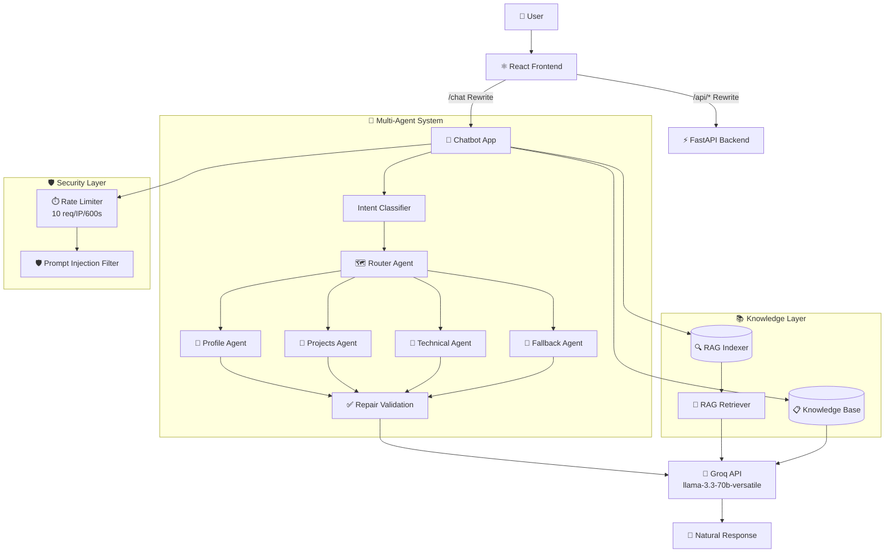
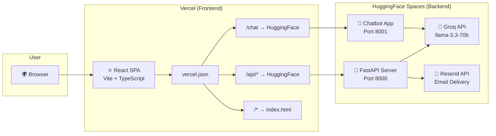

<div align="center">

# 🚀 Asad Shabir — AI & Full-Stack Architect

> *Engineering intelligent agents. Building the bridge between AI and production.*

[](https://asad-shabir-portfolio.vercel.app)
[](https://huggingface.co/spaces/Asadali110/asad-shabir-portfolio-backend)
[](https://github.com/asadshabir)
[](https://www.linkedin.com/in/asad-shabir-programmer110/)
[](mailto:asadshabir505@gmail.com)

---

</div>

---

## 📖 The Story

> *"I believe the most powerful systems aren't just technical — they're **storytellers** in their own right. Every API endpoint, every agent, every line of code should serve a narrative."*

I'm **Asad Shabir** — an AI Engineer and Full-Stack Developer from **Sehwan Sharif, Sindh, Pakistan**. My journey has taken me from the discipline of the Pakistan Navy to the frontier of agentic AI, from telecom-grade DevOps at **Digitel FTE** to building intelligent systems that think, reason, and converse.

This portfolio isn't just a resume. It's a **living system** — an AI-infused digital presence where:

- 🤖 A **multi-agent chatbot** answers questions with RAG-powered precision
- 📊 A **project estimator** intelligently scopes your next build
- ⚡ A **resume reviewer** delivers NLP-driven feedback
- 🎨 A **3D animated interface** makes every interaction feel premium

Built with **Spec-Driven Development (SDD)** at its core — every feature starts with a spec, every plan precedes the code, and every commit tells a story.

---

## 🧠 The Brain — Multi-Agent Chatbot Architecture

The crown jewel of this portfolio is a **6-agent AI system** running on **Groq's llama-3.3-70b** via the **OpenAI Agents SDK**, orchestrated on a **FastAPI backend** hosted on HuggingFace Spaces.



### The Agent Team

| Agent | Role | Superpower |
|-------|------|------------|
| 🗺️ **Router** | Intent Classifier | Routes queries to the right specialist in &lt;200ms |
| 👤 **Profile** | Personal Voice | Speaks as *me* — first person, warm, authentic |
| 📁 **Projects** | Portfolio Guide | Walks through projects with live demo links |
| 🔧 **Technical** | Knowledge Base | Deep-dive into skills, stack, and architecture |
| 🔄 **Fallback** | Graceful Handler | Polite redirection for off-topic queries |
| ✅ **Repair** | Validation Layer | 6-point safety check with auto-retry on failure |

> **🌐 Language Support:** The chatbot seamlessly switches between **English**, **Urdu (اردو)**, and **Sindhi (سنڌي)** — reflecting the linguistic diversity of Pakistan.

---

## ✨ Feature Showcase

| # | Feature | Description | Status |
|---|---------|-------------|--------|
| 🤖 | **AI ChatBot** | 6-agent system with RAG, intent routing, repair validation | ✅ Live |
| 📊 | **Project Estimator** | AI-powered cost & timeline estimation for your idea | ✅ Live |
| ⚡ | **Resume Reviewer** | NLP-driven resume scoring with actionable feedback | ✅ Live |
| 📝 | **Blog Engine** | Technical blog with 3 posts on AI, FastAPI, automation | ✅ Live |
| 📋 | **Case Studies** | Real-world project deep dives with architecture insights | ✅ Live |
| 📬 | **Contact Form** | Serverless email delivery via Resend API | ✅ Live |
| 📧 | **Email Capture** | Newsletter subscription for updates & insights | ✅ Live |
| 📈 | **Analytics Dashboard** | Admin metrics panel with Recharts visualization | ✅ Live |

---

## 🛠️ The Tech Stack

### Frontend — *The Canvas*


### Backend — *The Engine Room*


### Infrastructure — *The Backbone*


### Design System

The visual identity is built on a **deep minimal** aesthetic with neon accents:

```css
--background: #0A0A0A;    /* Deep space black */
--primary:    #22D3EE;    /* Neon cyan — energy & precision */
--secondary:  #C026D3;    /* Magenta — creativity & depth */
```

Every component — from the **floating particles** to the **3D cards** to the **aceternity-style animations** — follows this palette.

---

## 🌐 Deployment Topology



**Live URLs:**
| Layer | URL |
|-------|-----|
| 🌐 Frontend | [asad-shabir-portfolio.vercel.app](https://asad-shabir-portfolio.vercel.app) |
| ⚡ Backend | [huggingface.co/spaces/Asadali110/asad-shabir-portfolio-backend](https://huggingface.co/spaces/Asadali110/asad-shabir-portfolio-backend) |
| 🏠 GitHub | [github.com/asadshabir/asad-shine-hub](https://github.com/asadshabir/asad-shine-hub) |

---

## 🚀 Featured Projects

| Project | Story | Stack | Links |
|---------|-------|-------|-------|
| **ASA-Mind** | A flagship AI chat assistant powered by OpenAI Agents SDK. Multi-agent orchestration with streaming responses, memory, and tool use. Designed to be the *brain* behind intelligent applications. | OpenAI Agents SDK, FastAPI, React, Supabase | [GitHub](https://github.com/asadshabir/asa-mind) |
| **AI-Powered Robotics Book** | An interactive, AI-generated educational book exploring the intersection of robotics and artificial intelligence. Generated page-by-page using AI, then published as a dynamic Next.js site. | Next.js, OpenAI, TypeScript | [GitHub](https://github.com/asadshabir/robotics-ai-book) |
| **E-Commerce Platform** | A production-grade e-commerce platform with Stripe payment integration, Supabase authentication, admin dashboard, and inventory management. | Next.js, Supabase, Stripe | [GitHub](https://github.com/asadshabir/ecommerce-platform) |
| **Workflow Automation Engine** | A rule-based automation engine that connects APIs, schedules triggers, and orchestrates multi-step workflows. Built for production reliability. | Python, FastAPI, Celery, Redis | [GitHub](https://github.com/asadshabir/workflow-automation) |
| **AI Resume Analyzer** | An NLP-powered resume parser that scores, analyzes, and provides actionable improvement suggestions. Built with LangChain for intelligent document understanding. | Python, LangChain, React, FastAPI | [GitHub](https://github.com/asadshabir/ai-resume-analyzer) |
| **Real-Time Dashboard** | Live analytics dashboard with WebSocket-powered real-time updates, role-based access control, and interactive data visualizations. | React, Node.js, PostgreSQL, WebSockets | [GitHub](https://github.com/asadshabir/realtime-dashboard) |

---

## ⚡ Quick Start

```bash
# Clone the repository
git clone https://github.com/asadshabir/asad-shine-hub.git
cd asad-shine-hub

# Install dependencies
npm install

# Start development server
npm run dev          # Frontend → localhost:8080
# (Backend requires HuggingFace Spaces or local Python setup)
```

> **💡 Pro tip:** The `vercel.json` proxy rewrites `/api/*` and `/chat` to the live HuggingFace backend — so the frontend works seamlessly against production AI services even in local development.

---

## 📜 Development Philosophy

This project follows **Spec-Driven Development (SDD)** — a disciplined approach where:

1. **📋 Spec** — Every feature begins with a detailed specification
2. **📐 Plan** — Architecture and design decisions are documented
3. **✅ Tasks** — Work is broken into testable, dependency-ordered tasks
4. **💚 Red/Green/Refactor** — TDD cycle with clear acceptance criteria
5. **📝 PHR** — Every prompt is recorded as a Prompt History Record for traceability

This repository contains **10+ Claude Code agents** (API Engineer, Chatbot Orchestrator, UI Enhance, QA/E2E, Security Guardrails, and more) that help enforce SDD discipline across every change.

---

## 🤝 Let's Connect

I'm always open to discussing AI, agentic systems, full-stack architecture, or potential collaborations.

<div align="center">

[](mailto:asadshabir505@gmail.com)
[](https://www.linkedin.com/in/asad-shabir-programmer110/)
[](https://github.com/asadshabir/)
[](https://www.facebook.com/Asadalibhatti110)

📄 **Resume:** [Download PDF](/Asad_Shabir_Resume.pdf)

</div>

---

<div align="center">

*Built with passion, AI, and a commitment to Spec-Driven Development.*  
*© 2026 Asad Shabir — All rights reserved.*

⭐ Star this repo if you find it inspiring!  
[🔗 Live Portfolio](https://asad-shabir-portfolio.vercel.app) · [🐍 Backend](https://huggingface.co/spaces/Asadali110/asad-shabir-portfolio-backend)

</div>
